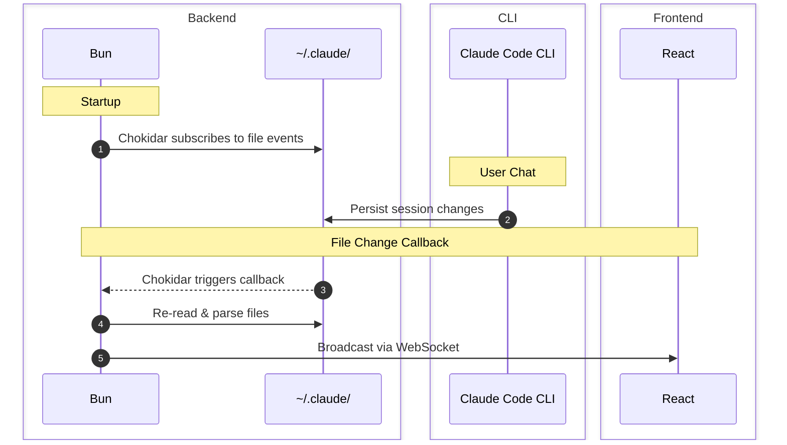

# Claude Code Usage


A live dashboard that reads Claude Code’s local files, tracks token usage by project and session, and estimates what you would pay using API pricing.

https://github.com/user-attachments/assets/9efc6ab9-0461-49a2-9c44-9bdab2903824

---

## What it does

* Measures input, output, and cache tokens per session and project
* Shows activity peaks by hour, day, and time range
* Estimates API equivalent cost, including cache savings
* Updates live while you work
* Never inspects content, only volume and time ⌛️

---

## How it works


* Watches `~/.claude` for file changes (using [Chokidar](https://github.com/paulmillr/chokidar))
* Parses Claude JSONL session logs
* Aggregates usage in memory
* Streams updates to a local React dashboard using WebSocket

More details in [docs/how-it-works.md](docs/how-it-works.md).

---
## Install

```bash
curl -fsSL https://ocodista.com/claude-usage-install.sh | bash
```

## Run

```bash
claude-code-usage
```

Opens at [http://localhost:3190](http://localhost:3190)

---

## Uninstall

```bash
curl -fsSL https://ocodista.com/claude-usage-uninstall.sh | bash
```

---

## Privacy

All data stays on your machine.
This tool reads files Claude already wrote.

---

## License

MIT
