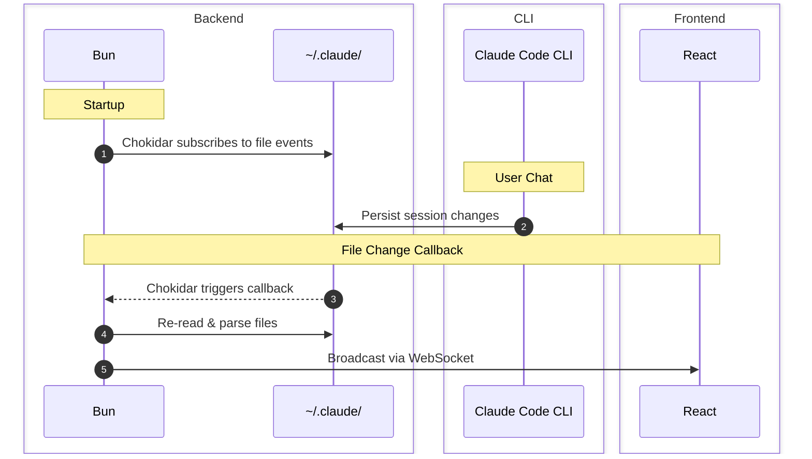
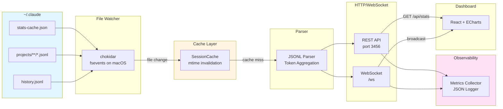

# How It Works

Real-time Claude Code token usage monitor. Watches Claude's data files, parses JSONL sessions, and serves metrics via WebSocket.

**Stack**: Bun, TypeScript, React 18, chokidar, ECharts

## Data Flow



## Architecture



## Server Layer

### HTTP Endpoints

| Endpoint | Method | Purpose |
|----------|--------|---------|
| `/` | GET | Dashboard HTML |
| `/api/stats` | GET | Full token statistics |
| `/api/session/:id` | GET | Per-message breakdown for session |
| `/api/errors` | GET | Last 10 parse errors |
| `/api/metrics` | GET | Server performance metrics |
| `/health` | GET | Health check (200/503) |
| `/ws` | WS | Live updates |

### WebSocket Protocol

**Message types**:
- `initial`: Sent on connection with current stats
- `stats_update`: Broadcast on file changes
- `server_closing`: Sent before shutdown

**Flow**:
1. Client connects to `/ws`
2. Server sends `initial` with full `TokenStats`
3. File change → parser runs → `stats_update` broadcast
4. No message queuing; clients reconnect if disconnected

**Implementation** (`src/server/index.ts`):
- `Set<WebSocket>` tracks connected clients
- Failed sends auto-remove client from set
- Graceful shutdown notifies clients before exit

### Graceful Shutdown

On SIGTERM/SIGINT:
1. Stop file watcher
2. Send `server_closing` to all clients
3. Wait up to 5s for clients to disconnect
4. Exit

## File Watcher

Uses chokidar wrapping native OS APIs (fsevents on macOS, inotify on Linux).

**Watch targets**:
- `~/.claude/stats-cache.json`
- `~/.claude/projects/**/*.jsonl`

**Configuration** (`src/server/watcher.ts:32-39`):
```typescript
chokidar.watch([STATS_FILE, join(PROJECTS_DIR, "**/*.jsonl")], {
  persistent: true,
  ignoreInitial: true,
  awaitWriteFinish: {
    stabilityThreshold: 100,
    pollInterval: 50,
  },
})
```

**Debounce**: 150ms batches rapid writes into single parse.

**Performance**:
- Zero CPU when idle (kernel notifications, not polling)
- ~5-10ms from file write to callback

## Parser

### Data Sources

| File | Content |
|------|---------|
| `stats-cache.json` | Claude's pre-computed daily activity, model usage |
| `projects/**/*.jsonl` | Session transcripts (one JSON per line) |
| `history.jsonl` | Session metadata (display names, project paths) |

### JSONL Processing

Each line is a valid JSON object. Parser:
1. Reads file content
2. Splits by newline
3. Parses each line (skips malformed)
4. Extracts `usage` from assistant messages
5. Aggregates tokens by session

### Cost Calculation

**Pricing** (per 1M tokens, Dec 2024):

| Model | Input | Output | Cache Read | Cache Write |
|-------|-------|--------|------------|-------------|
| Opus 4.5 | $15 | $75 | $1.875 | $18.75 |
| Sonnet 4.5 | $3 | $15 | $0.30 | $3.75 |
| Haiku 3.5 | $0.80 | $4 | $0.08 | $1.00 |

**Formula** (`src/server/parser.ts:38-52`):
```typescript
cost = (input / 1M) * rate.input +
       (output / 1M) * rate.output +
       (cacheRead / 1M) * rate.cacheRead +
       (cacheWrite / 1M) * rate.cacheWrite
```

**Cache efficiency**: `(cacheReadTokens / totalWithCache) * 100`

## Session Cache

In-memory cache for parsed session data. Avoids re-parsing unchanged files.

**Strategy** (`src/server/session-cache.ts`):
- Key: session ID
- Value: `SessionInfo` + file mtime
- Validation: compare stored mtime against current file mtime
- Invalidation: on file change notification

**Cache flow**:
1. Check cache for session ID
2. If found, verify mtime matches
3. Hit: return cached data
4. Miss: parse file, store result with mtime

## Observability

### Metrics Collector

Tracks (`src/server/metrics.ts`):
- `uptime`: Server uptime in ms
- `connectedClients`: Current WebSocket connections
- `totalParses`: Parse operation count
- `avgParseTimeMs`: Average parse duration
- `parseErrors`: Error count
- `cacheHits` / `cacheMisses`: Cache effectiveness

**Health check** (`/health`):
- Returns 200 if `avgParseTimeMs < 100` and `parseErrors < 10`
- Returns 503 otherwise (degraded)

### Structured Logging

JSON format (`src/server/logger.ts`):
```json
{"timestamp":"2024-12-31T12:00:00Z","level":"info","message":"Parse completed","context":{"durationMs":23.5}}
```

## CLI

Entry point: `src/cli.ts`

**Commands**:
| Command | Action |
|---------|--------|
| `start` | Start dashboard server (default) |
| `stats` | Print token stats to stdout |
| `open` | Open browser to dashboard |
| `version` | Print version |
| `help` | Show usage |

## Client

### Connection

The `useTokenData` hook (`src/client/hooks/use-token-data.ts`):
1. Creates WebSocket to `/ws`
2. Receives `initial` message → sets state
3. Receives `stats_update` → updates state
4. On disconnect → reconnects after 2s

### Rendering

- Single HTML file with Tailwind, React, Babel, ECharts from CDN
- ECharts receives data via React state
- No build step for client (Babel transforms JSX in-browser)

## Build & Deployment

### Development

```bash
bun run src/server/index.ts
```

No compilation required. Bun executes TypeScript directly.

### Cross-Platform Binaries

`build.ts` compiles standalone binaries:
- `darwin-x64` (macOS Intel)
- `darwin-arm64` (macOS Apple Silicon)
- `linux-x64`
- `windows-x64`

### Plugin Mode

`.claude-plugin/plugin.json` registers plugin for Claude Code.
Server runs as child process managed by Claude Code.

## Latency Breakdown

| Step | Time |
|------|------|
| Claude writes JSONL | ~1ms |
| fsevents notification | ~5-10ms |
| Debounce wait | 150ms |
| Parse (cache miss) | ~20-50ms |
| WebSocket send | ~1ms |
| React render | ~10-20ms |
| **Total** | **~180-230ms** |

**Bottleneck**: Debounce delay (intentional batching).

**Optimization opportunities**:
- Incremental parsing (track file position)
- Streaming JSONL parser
- Differential updates (send deltas)

## Type Safety

Shared types in `src/client/types.ts`:
- `TokenStats`: Full statistics payload
- `SessionInfo`: Per-session summary
- `WebSocketMessage`: Message envelope

Parser returns typed objects. No runtime validation (internal tool assumption).
